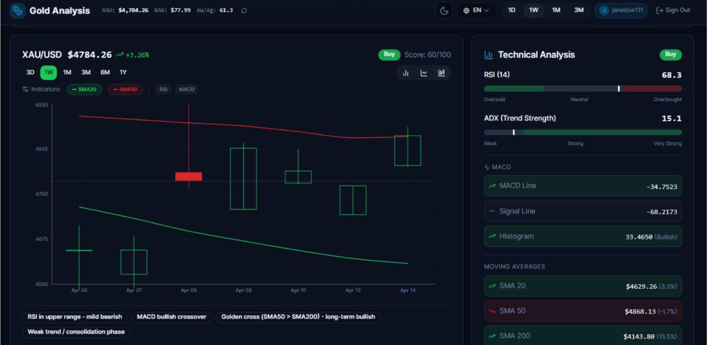
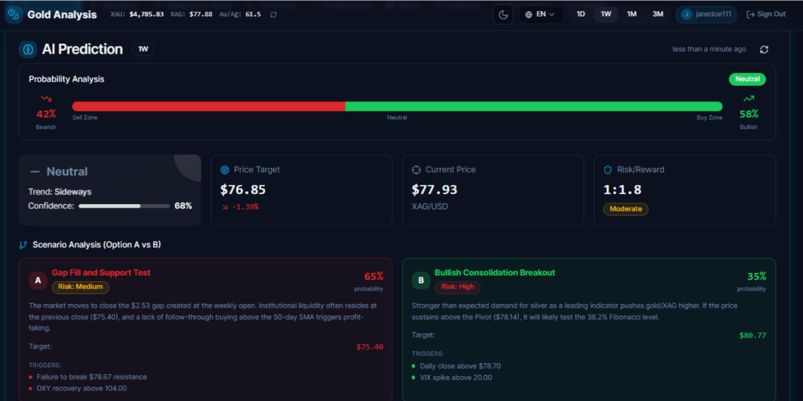
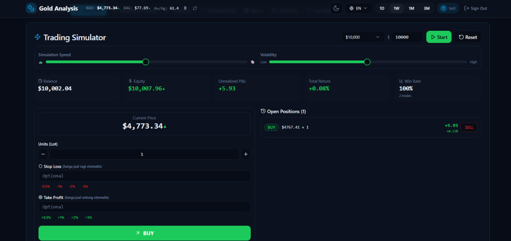
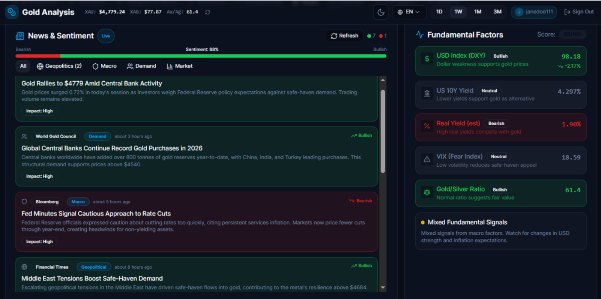
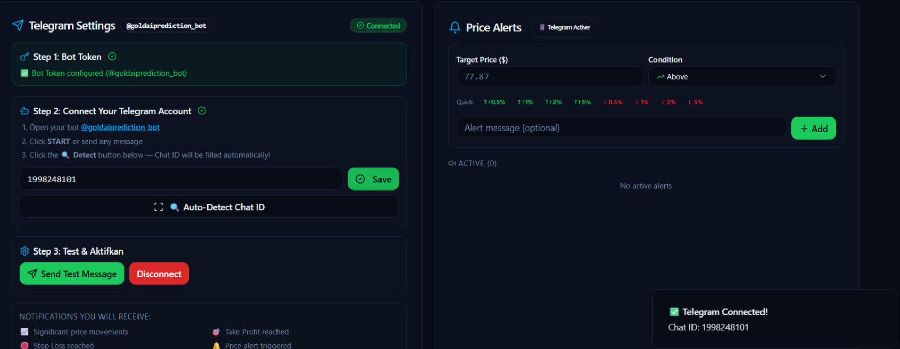

# 🏆 Gold Analysis Platform


A real-time market intelligence platform for **XAU/USD (Gold)** and **XAG/USD (Silver)** featuring AI-powered predictions, technical analysis, Telegram alerts, paper trading simulation, and market sentiment insights.

🌐 Live Demo: https://goldaiprediction.vercel.app/

---

## 🚀 Overview

Gold Analysis Platform is a production-ready financial intelligence system designed to provide retail investors with institutional-grade market analysis tools for free.

The platform combines:

* Real-time Gold & Silver Prices
* AI Prediction Engine
* Technical Indicators
* News & Sentiment Analysis
* Telegram Alert System
* Paper Trading Simulator
* Economic Calendar
* Correlated Asset Analysis

Unlike traditional educational projects, the platform is fully deployed and continuously updated using live market data.

---

## ✨ Features

### 📈 Real-Time Market Data

* Live XAU/USD tracking
* Live XAG/USD tracking
* 15-second market refresh
* 1-second tick simulation

### 🤖 AI Prediction Engine

Generate:

* Bullish scenarios
* Bearish scenarios
* Confidence levels
* Risk / Reward analysis
* Indicator-based reasoning

### 📊 Technical Analysis

Supported indicators:

* MA20
* MA50
* EMA12
* EMA26
* Bollinger Bands
* Fibonacci Retracement
* RSI
* MACD
* ADX

### 🔔 Telegram Alerts

Users can:

* Connect Telegram Bot
* Configure price alerts
* Receive market notifications
* Receive trade updates

### 💹 Paper Trading Simulator

* Long & Short positions
* Real-time P&L
* Stop Loss
* Take Profit
* Virtual balance management

### 📰 Market Intelligence

* News Sentiment Analysis
* Economic Calendar
* Expert Analysis
* Correlated Assets Dashboard

### 🌎 Internationalization

* English
* Indonesian

---

## 🏗 System Architecture

```text
User
 │
 ▼
React + TypeScript Frontend
 │
 ▼
Vercel Serverless Functions
 │
 ├── Stooq API
 ├── Yahoo Finance API
 ├── Telegram Bot API
 │
 ▼
Supabase
 ├── Authentication
 ├── PostgreSQL
 └── User Profiles
```

---

## ⚙ Tech Stack

| Layer           | Technology                  |
| --------------- | --------------------------- |
| Frontend        | React 18 + TypeScript       |
| UI              | Tailwind CSS + shadcn/ui    |
| Charts          | Recharts                    |
| Backend Proxy   | Vercel Serverless Functions |
| Database        | Supabase PostgreSQL         |
| Authentication  | Supabase Auth               |
| Hosting         | Vercel                      |
| Market Data     | Stooq API                   |
| Historical Data | Yahoo Finance API           |
| Notifications   | Telegram Bot API            |

---

## 📸 Platform Showcase

### 📊 Advanced Technical Analysis

Interactive candlestick chart with real-time market data and professional trading indicators including MA20, MA50, EMA12, EMA26, Bollinger Bands, Fibonacci Retracement, RSI, MACD, and ADX.



---

### 🤖 AI Market Prediction Engine

AI-powered market analysis generating bullish and bearish scenarios, confidence scores, risk/reward ratios, and indicator-based reasoning to support investment decisions.



---

### 💹 Paper Trading Simulator

Practice trading strategies with virtual funds using live market prices. Supports Long/Short positions, Take Profit, Stop Loss, and real-time profit & loss tracking.



---

### 📰 News & Sentiment Intelligence

Market sentiment monitoring with dynamically generated news insights and sentiment analysis based on current gold price movements and market conditions.



---

### 🔔 Telegram Alert System

Receive instant notifications directly on Telegram when custom price targets are reached or trading events occur.



---

## 📌 Key Highlights

### Zero Mock Data Architecture

Every displayed value is either:

* fetched from live APIs
* generated dynamically from current market conditions

No hardcoded market data is used.

### Real-Time Pricing Engine

* Stooq refresh every 15 seconds
* Tick simulation every second
* Automatic chart updates

### Dual Persistence System

Data is stored in:

* localStorage
* Supabase PostgreSQL

allowing both offline resilience and cloud synchronization.

---

## 🛠 Installation

```bash
git clone https://github.com/tintinbunyispeda/goldanalysis.git

cd goldanalysis

npm install

npm run dev
```

Create:

```env
VITE_SUPABASE_URL=
VITE_SUPABASE_PUBLISHABLE_KEY=
VITE_TELEGRAM_BOT_TOKEN=
```

Run:

```bash
npm run dev
```

---

## 🎯 Future Improvements

* Real LLM-powered market prediction
* Live news API integration
* Real correlated asset feeds
* Server-side Telegram alerts
* Mobile application
* Historical backtesting engine
* Brokerage integration

---

## 👥 Authors

* Cristine Valentina
* Habil Baihaki Ramadhan
* Johana Veronica Setiawan
* Nasywa Chonifahtun Fiqrihiyah
* Nisrina Izza Nur Aisyah
* Shanty

---

## 📚 Academic Project

Developed for Artificial Intelligence 1, Faculty of Computer Sciences, President University.

---

## 📄 License

MIT License

